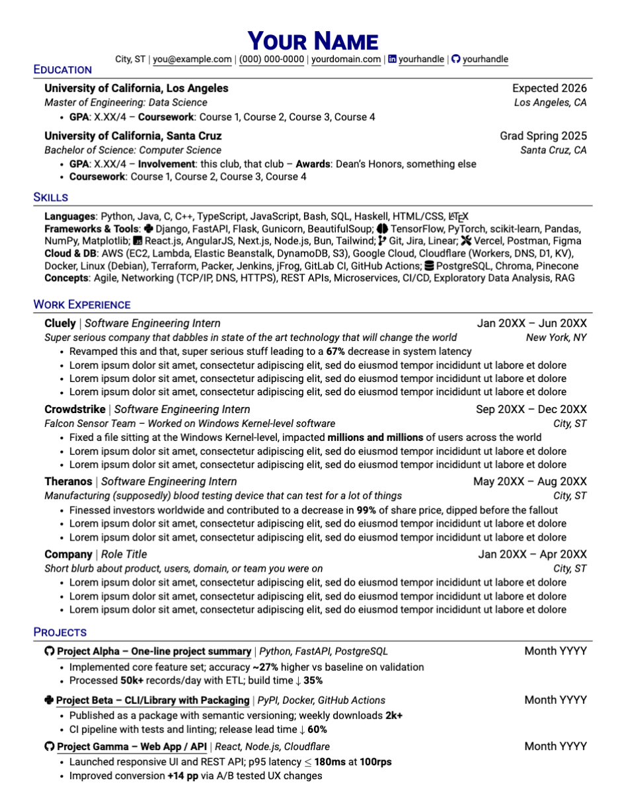

# resume

Based it off [Jake's](https://github.com/jakegut/resume) and [Martin's](https://martinsit.ca) resume with my own modifications

## Man how do I work this?

Basically, sign onto [Overleaf](https://www.overleaf.com), create a new blank project, create a new `resume.tex`, copy [`template.tex`](template.tex) into it, and bim bam boom start editing (switch to visual editor if you're not familiar with LaTeX)

My own resume is accessible [here](https://harshdadhich.com/resume/latest.pdf), feel free to refer to how I structured stuff in [`latest.tex`](latest.tex)

## License

MIT
